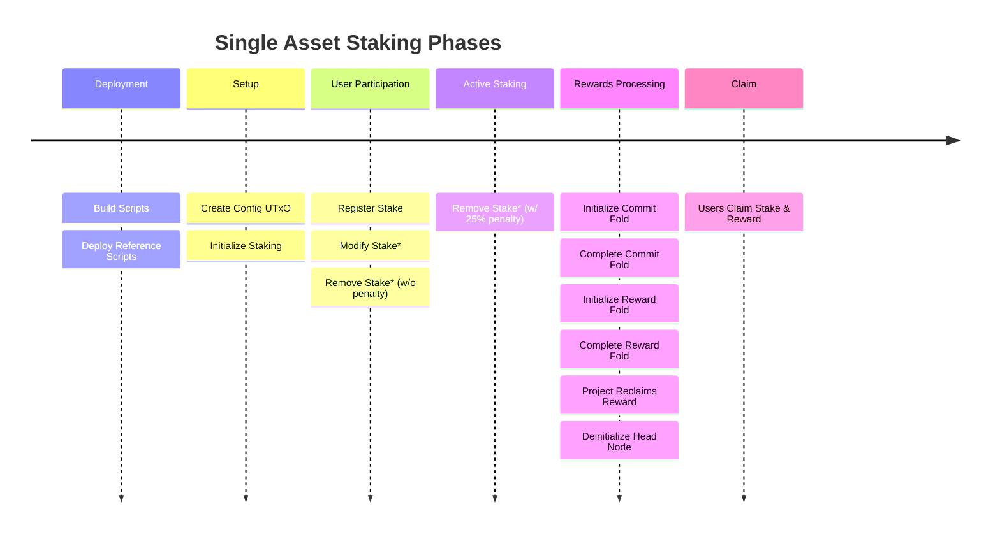
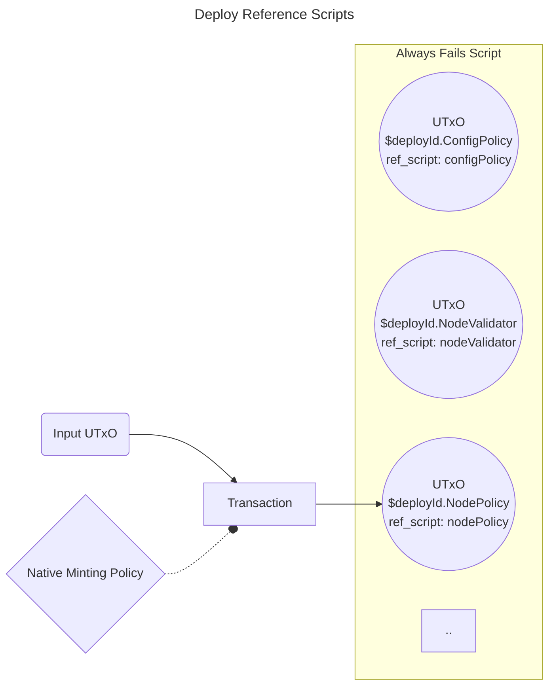
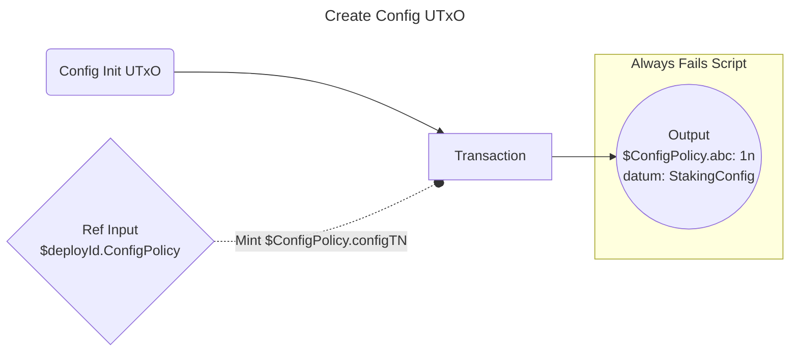
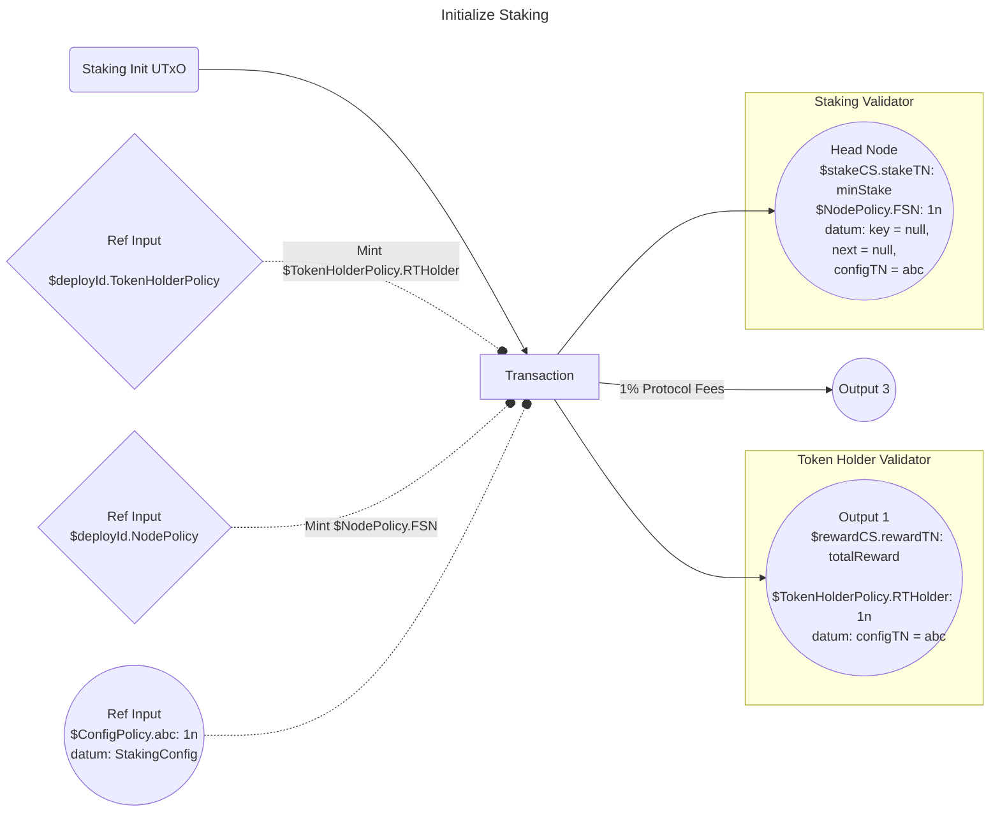
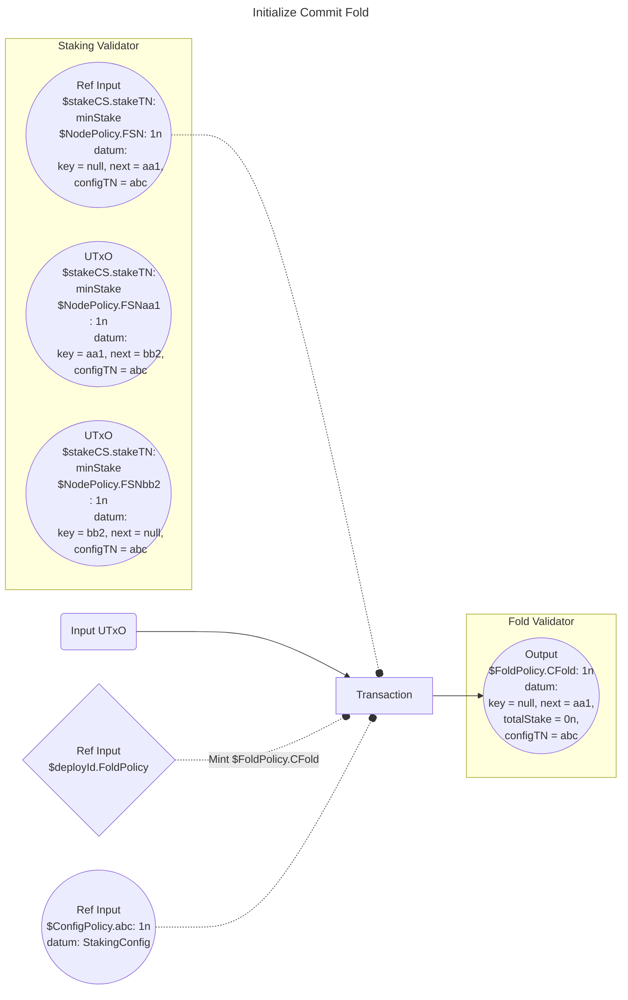
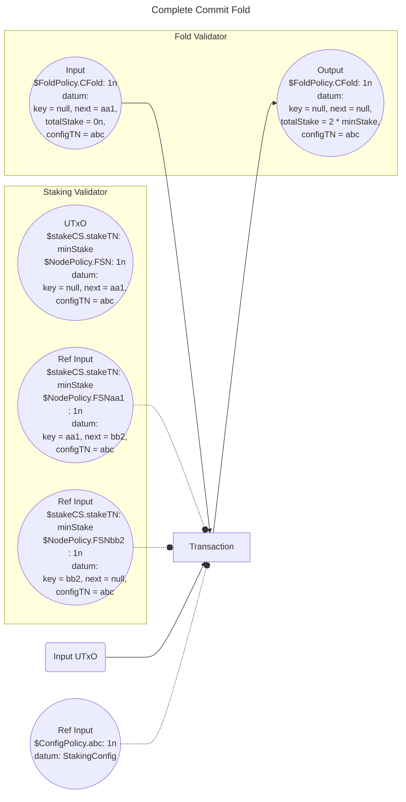
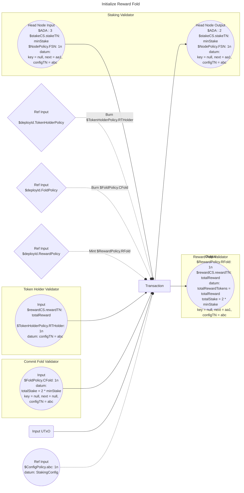
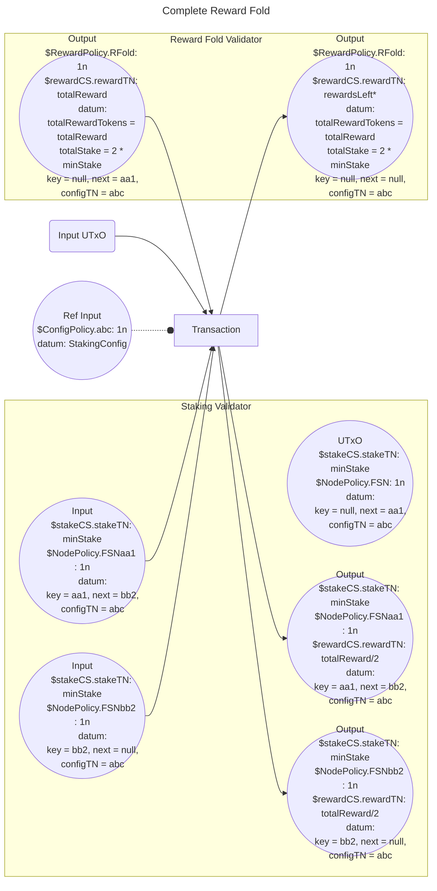

# Single Asset Staking Offchain

## Table of Contents

- [Introduction](#introduction)
- [Overview](#overview)
- [Details](#details)
  - [Deployment](#deployment)
    - [Build Scripts](#build-scripts-buildscriptsts)
    - [Deploy Reference Scripts](#deploy-reference-scripts-deployrefscriptsts)
  - [Setup](#setup)
    - [Create Config UTxO](#create-config-utxo-createconfigts)
    - [Initialize Staking](#initialize-staking-initstakingts)
  - [User Participation](#user-participation)
  - [Active Staking](#active-staking)
  - [Rewards Processing](#rewards-processing-processrewardsts)
    - [Initialize Commit Fold](#initialize-commit-fold-initfoldts)
    - [Complete Commit Fold](#complete-commit-fold-multifoldts)
    - [Initialize Reward Fold](#initialize-reward-fold-initrewardfoldts)
    - [Complete Reward Fold](#complete-reward-fold-rewardfoldnodests)
    - [Project Reclaims Reward](#project-reclaims-reward-reclaimrewardts)
    - [Deinitialize Head Node](#deinitialize-head-node-dinitnodets)
  - [Claim](#claim-reclaimnodets)
- [Important Notes](#important-notes)
- [Local Build](#local-build)
- [Tests](#tests)
  - [Test Framework](#testing-framework)
  - [Running Tests](#running-tests)

# Introduction

"Single Asset Staking Offchain" project provides the necessary SDK to interact with "Single Asset Staking Contracts". These contracts facilitate collective staking of digital assets and distributing rewards among participants in a completely on-chain and trustless manner.

As the name suggests, it allows for a single asset, which can be any Cardano Native Fungible Token, to be staked to earn rewards. The reward itself can be any Cardano Native Fungible Token. The contracts are parameterized with `policyId` and `tokenName` (in addition to a few others) of stake token and reward token. This allows different projects conducting the Staking event to configure the contracts accordingly.

Instead of a fixed percentage based return, the staking reward obtained is not known beforehand. Because its determined by the total amount of assets staked till the end of the staking period and the total rewards locked before staking begins. Eligible participants are then given rewards propotional to their share of stake (`(userStake * totalRewards) / totalStake`).

The contracts are available at [Single Asset Staking](https://github.com/Anastasia-Labs/single-asset-staking).

# Overview

An interesting technical detail about this protocol is the use of an [on-chain association list](https://github.com/Plutonomicon/plutonomicon/blob/main/assoc.md). It maintains every unique public key's stake in a separate UTxO which points to the next stake UTxO. Every UTxO in the list will have `StakingSetNode` in its datum.

```hs
data StakingSetNode = MkSetNode
  { key :: StakingNodeKey  -- owner wallet's PaymentPubKeyHash
  , next :: StakingNodeKey -- next PaymentPubKeyHash in a list of lexicographically sorted key hashes
  {- This field tells us which Staking Campaign this node belongs to.
     Each Staking Campaign is uniquely identified by a Config UTxO
     containing an NFT (configCS.configTN) -}
  , configTN :: TokenName
  }

data StakingNodeKey = Key BuiltinByteString | Empty
```

This sections provides you with the timeline of different phases involved in Single Asset Staking. With each phase further listing the order of actions which comprises it.



> Note: [*] - Actions which can be performed if user wishes to.

# Details

## Deployment

Everything begins here with _Anastasia Labs_ configuring and providing the Smart Contracts, on-chain as Reference Scripts. Once these are available, Projects can reuse the same contracts for any number of new Staking Campaigns. The deployment phase comprises of below two actions.

### **Build Scripts** `buildScripts.ts`

The contracts available from Single Asset Staking repository, require certain paramters to be applied. These parameters include `configCS` (policyId of ConfigPolicy) and script credentials in case of dependant scripts. This step involves providing contracts with the required parameters.

### **Deploy Reference Scripts** `deployRefScripts.ts`

This step uses the applied validators obtained above to create a [Reference Script UTxO](https://github.com/cardano-foundation/CIPs/tree/master/CIP-0033) for every validator. In order to easily identify a particular validator on-chain, a native minting policy is used in conjuction. It mints an NFT with the validator name and is made available inside the RefUTxO. This native minting policy allows minting for a very short duration of _thirty mintues_ within which all the RefUTxOs must be created. All the RefUTxOs are sent to an "Always Fail Script" address ensuring they are immutable and locked forever.



## Setup

Every Project which wants to create a new Staking Campaign will start from here. This phases consists of below three actions. Its only after this phase is completed that users can begin staking.

### **Create Config UTxO** `createConfig.ts`

Every individual Staking Campaign begins by first creating a Config UTxO for it. It works like this:

- Every Staking Campaign's configuration, instead of being configured in the contract as parameters, is obtained from a Config UTxO's datum. This datum (of type `StakingConfig`) contains all the event related details. Thereby leaving the same set of contracts to work for multiple campaigns.

```hs
data StakingConfig = StakingConfig
  { stakingInitUTxO :: TxOutRef
  , freezeStake :: POSIXTime
  , endStaking :: POSIXTime
  , penaltyAddress :: Address
  , stakeCS :: CurrencySymbol
  , stakeTN :: TokenName
  , minimumStake :: Integer
  , rewardCS :: CurrencySymbol
  , rewardTN :: TokenName
  }
```

- All the deployed smart contracts require this Config UTxO as a reference input to validate every transaction.
- With the help of a Config Policy, this UTxO is uniquely identified by an NFT (`configCS.configTN`), minted in the same transaction.
- This ouput is then sent to an Always Fails Script address, guaranteeing no changes to the camapaign parameters.
- All the UTxOs belonging to a particular campaign will have the same `configTN` field value in their datum to avoid mixing UTxOs from different campaigns.



### **Initialize Staking** `initStaking.ts`

Here project locks the entire staking reward in `tokenHolderValidator`. The total reward amount will be distributed among participants in proportion to their stake. Locking of rewards beforehand gives high assurance to all the participants before they can begin staking. Additional one percent of total reward amount is paid as protocol fees for facilitating staking to Anastasia Labs.

> Note: The wallet containing the `stakingInitUTxO` must have enough reward tokens to cover the total reward amount plus 1% protocol fees along with
> sufficient lovelaces to cover mininum ADA costs and transaction fees.

This transaction also marks the beginning of the association list which will contain all the stake by different participants as separate UTxOs. The first node of the list know as head node is created in this step.

Head node differs from all the nodes in that its key is null. Every valid stake UTxO in the list has a unique "Node Token" which is minted by `nodePolicy` at the time of its insertion. The token name is derived as NODE_PREFIX ("FSN") + PaymentPubKeyHash thereby making every node token unique. Head node just has NODE_PREFIX as the token name.



## User Participation

Now the Staking event is opened and users can participate by locking their stake in `nodeValidator` by updating the linked list. Before the stake is frozen, participants can choose to increase, decrease or remove their stake altogether.

## Active Staking (`insertNode.ts`, `modifyNode.ts`, `removeNode.ts`)

Once stake is frozen (configured by parameter `freezeStake :: POSIXTime`), the active staking phase begins for which the participants will be earning rewards. This phase lasts till `endStaking :: POSIXTime` as decided by the project. During this period, new participants cannot enter nor can the old ones modify their stake. However, existing stakers can still get their stake back if they choose to, by paying 25% of their stake as penalty fee.

## Rewards Processing `processRewards.ts`

After the active staking phase has ended (after `endStaking :: POSIXTime`) comes the part where project processes and allocates rewards to its participants who staked till now.

Its done by first calculating and saving the total amount staked on-chain. Then every participant's stake UTxO is updated to include rewards in it, in proportion to their stake. Reward calculation is given by the formula `(userStake * totalRewards) / totalStake`.

Following sequence of on-chain actions elaborate further on how rewards processing mechanism works. The `processRewards.ts` endpoint carries out all
the below actions for the project in a sequential manner.

### **Initialize Commit Fold** `initFold.ts`

Commit Fold carries out the computation of total staked amount by going over all the linked list UTxOs one after the other in order. The current state of the computation, i.e. how far along the linked list it has summed and the current sum, is stored in a UTxO at `foldValidator`. This UTxO is uniquely identified with the presence of an NFT ($FoldPolicy.CFold) minted using `foldPolicy`. This initialization of commit UTxO is perfomed in this step.



### **Complete Commit Fold** `multiFold.ts`

Here one stake UTxO after another is used as reference input to calculate and update `totalStake` value in Commit Fold UTxO's datum. This is done till the end of list is not reached, at which point `next = null` in fold datum and `totalStake` is finally determined. This endpoint needs to be called repeatedly till `fetchCampaignState` in `fetchState.ts` does not return `CapaignStatus.StakeCalculationEnded` in its CampaignStatus field of CampaignState.



> Note: Head Node's stake is never taken into account.

### **Initialize Reward Fold** `initRewardFold.ts`

Now that we have total staked amount available on-chain, we initialize the reward fold wherein a UTxO to `rewardFoldValidator` is sent. This contains total reward amount obtained from UTxO locked at "Token Holder Validator" along with `totalRewardTokens` and `totalStake` in its datum. Additionally, it has `$RewardPolicy.RFold` NFT minted from "Reward Policy" which validates that the initialization is carried out accurately.



> Note: Upon undergoing rewards fold a UTxO has to pay 1 ADA folding fee.

### **Complete Reward Fold** `rewardFoldNodes.ts`

With Reward Fold UTxO initialized with rewards and other essential information, rewards can be distributed into individual stake UTxO. This is similar to commit fold, with UTxO after head node being processed first and other UTxOs in the order they appear in list. Rewards fold gets concluded when `next = null` on processing the last UTxO of the list. Upon undergoing rewards fold a UTxO has to pay 1 ADA folding fee. This endpoint needs to be called repeatedly till `fetchCampaignState` in `fetchState.ts` does not return `CapaignStatus.UserClaimsAllowed` in its CampaignStatus field of CampaignState.



> Note: [*] - If any reward tokens are left due to remainder from integer division in `(userStake * totalRewards) / totalStake`

### **Project Reclaims Reward** `reclaimReward.ts`

Once the rewards are processed, project is free to claim any remaining project tokens left in "Reward Fold UTxO" along with any lovelaces present. They'll have to additionally burn "$RewardPolicy.RFold" token for this, which is only allowed when `next = null` i.e. all rewards are processed.

### **Deinitialize Head Node** `dinitNode.ts`

The project is also free to reclaim the Head Node with the "minStake" and lovelaces present in it. It can only be done after the reward fold is initiated (Reward Fold Token datum has `next == *head node's next*`), therefore ensuring no information is lost.

## Claim `reclaimNode.ts`

Only after rewards are processed can the participants claim their stake and reward. They can do so by spending their stake UTxO from "Staking Validator" after signing transaction with private key belonging to the PaymentPubKeyHash as `key` in UTxO's datum.

# Important Notes

1. Its advisable to use two different wallets, each containing one Init UTxO (`configInitUTxO` & `stakingInitUTxO`). So that they aren’t spent before their respective initialization transactions. The wallet containing the `stakingInitUTxO` must have enough reward tokens to cover the total reward amount plus 1% protocol fees, minimum stake requirement worth of stake tokens and sufficient lovelaces to cover mininum ADA costs and transaction fees.
2. Only `stakeTN` and `rewardTN` fields are expected to be UTF-8 encoded strings. All the other Currency Symbols/ Policy Ids and Token name strings are expected to Hex encoded strings.
3. The offchain expects Cardano Native Token amounts in their lowest denomination/unit. For example, if the Stake Token is [MIN](https://cardanoscan.io/token/29d222ce763455e3d7a09a665ce554f00ac89d2e99a1a83d267170c64d494e) which has 6 decimal places and you want 10 MIN to be the minimum stake. You will have to configure `minimumStake`(field in `StakingConfig` and other Config objects) to be `10 * 10^6` (`Amount * 10 ^ Decimals`) i.e `10_000_000`. Similarly, the reward amount the project wants to lock as total staking reward, specified by `rewardsAmount` must be in its lowest unit for e.g. if total reward is 1000 MIN then `rewardsAmount == 1_000_000_000`. Likewise, the reponses obtained from the endpoint will provide CNT amount values in their lowest unit. Fields like `totalStake` & `totalReward` (in `CampaignState`), `rewardAmount` in `InitStakingConfig` and `toStake` used while staking or modifying stake, adhere to this representation.
4. Once stake is frozen (configured by parameter `freezeStake :: POSIXTime`), the active staking phase begins for which the participants will be earning rewards. This phase lasts till `endStaking :: POSIXTime` as decided by the project. During this period, new participants cannot enter nor can the old ones modify their stake. However, existing stakers can still get their stake back if they choose to, by paying 25% of their stake as penalty fee.
5. All the transactions provided will have a validity range of 6 minutes. Attempting to perform any action using the SDK endpoints with less than 3 minutes of difference from either the `freezeStake` or `endStaking` will result in an error i.e. `|Date.now() - freezeStakeOrEndStaking| > 3 minutes`.
6. Using an on-chain association list for managing stake provides increased throughput with increased number of stakers. However, it
   is susceptible to contention due to multiple users updating the list concurrently. Hence, it is recommended that the project user of Maestro APIs (adding, modifying and withdrawing stake) implement a retry mechanism (with some delay) to handle failures encountered after submitting the signed transactions.
7. Every wallet that stakes need to provide 3 ADA along with the intended stake amount, greater than minimum stake that is configured by the
   project. Out of this 3 ADA, a variable folding fee ranging from ~1 to 1.5 ADA will be taken. The remaining ADA (minimum ADA requirement) will be returned to the wallet along with its stake and reward, after claims are open.

# Local Build

In the main directory

```
pnpm run build
```

# Tests

## Testing Framework

https://github.com/vitest-dev/vitest

## Running Tests

```sh
pnpm test
```


